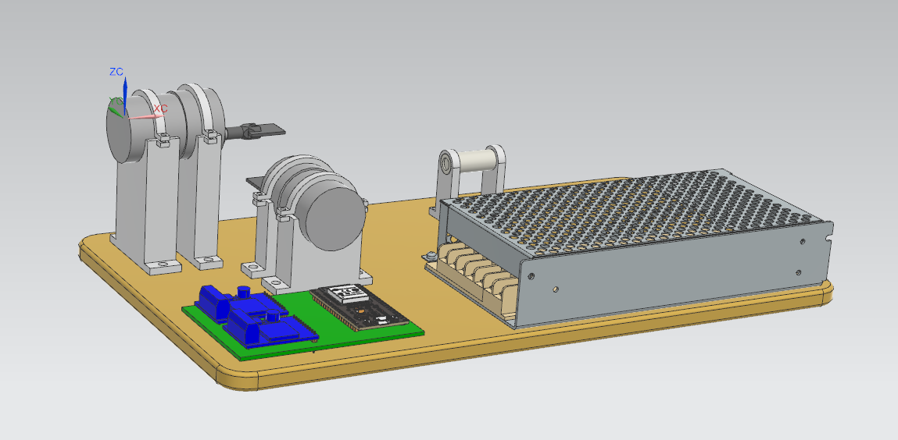
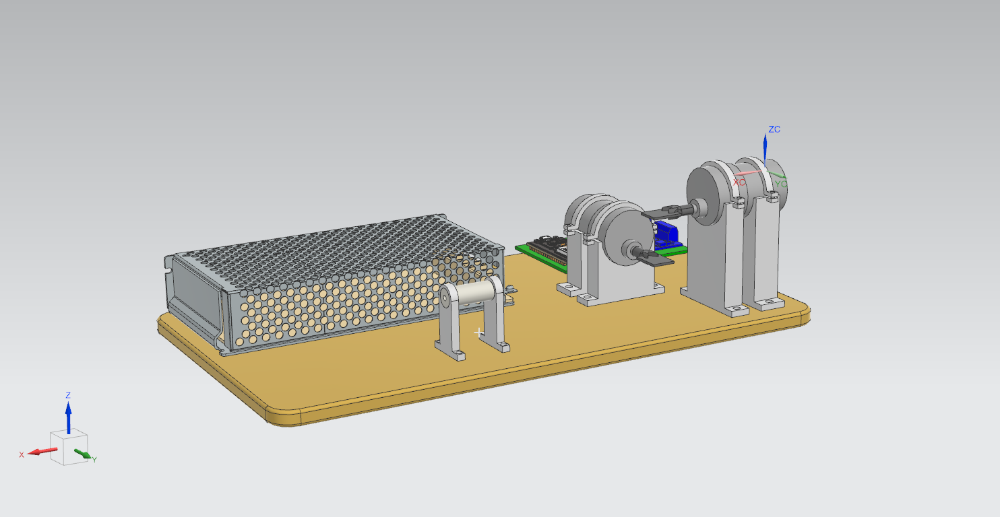

# IPZLaser 

## Table of contents
* [General info](#general-info)
* [Features](#features)

## General info
This project is a ESP32-based two-axis laser scanner using DC motors with encoders to reflect the beam. It can be controlled wirelessly.

## Features
* Automatic scanner mode
* 

